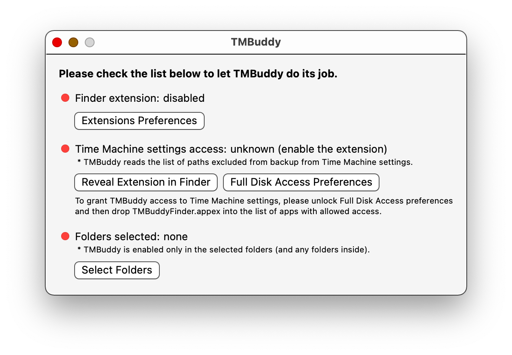
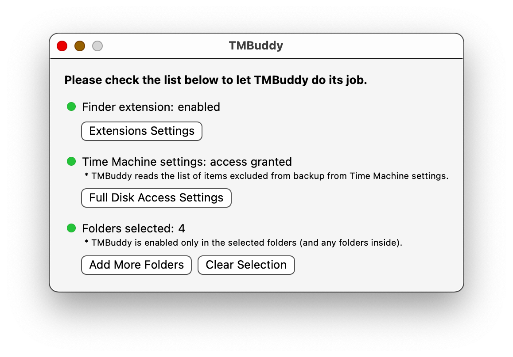
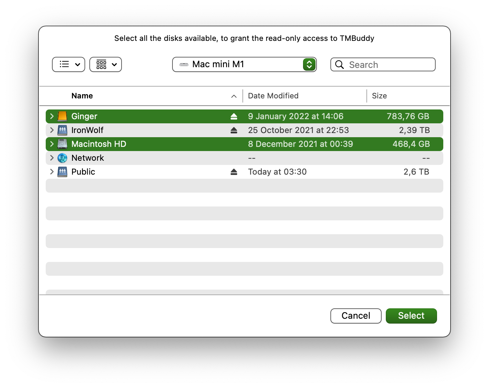
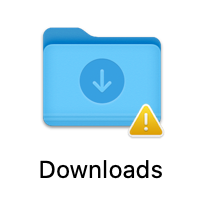

[](https://github.com/grigorye/TMBuddy/actions/workflows/build-app.yml)

# TMBuddy

See and manipulate exclusions from Time Machine backup, right in Finder.

## Installation

1. Get the app
   
   - from TestFlight:
     [Join the ™ Buddy beta - TestFlight - Apple](https://testflight.apple.com/join/gQCBR8p7)
   
   - from Homebrew:
     
     ```
     brew install grigorye/tools/time-machine-buddy
     ```

2. Launch the app and follow the checklist, making sure all the red lights:
   
   turned green:
   

When selecting folders for the application, typically you want to navigate to Computer and select all the disks for which you want to employ TMBuddy:


## What works

- Shows exclusion status for every item on the system disk (if you see the caution icon ⚠️ by the item, it means that the item is for sure not backed up):
  
  

## TODO

- Speedup lookups

- Add support for managing exclusion from backup via contextual menu command
