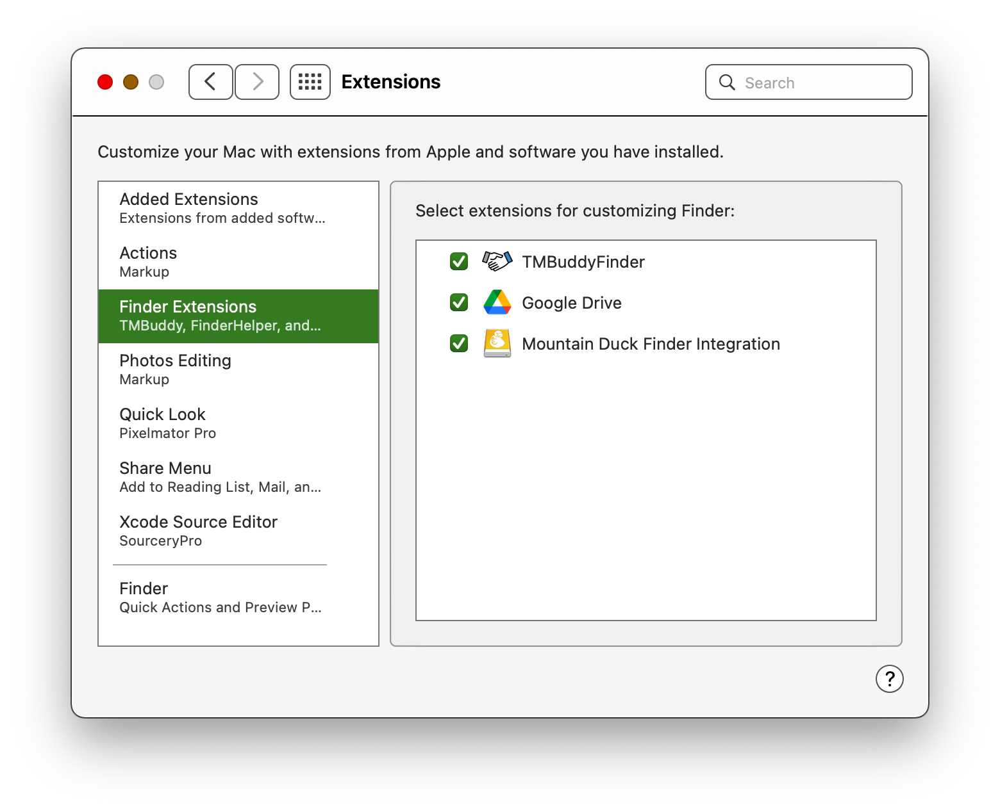

# TMBuddy

See and manipulate exclusions from Time Machine backup, right in Finder.

## Installation

1. Get the app

2. Make sure TMBuddyFinder is selected in System Settings > Extensions > Finder Extensions:
   
   

3. Select "Grant (Read-Only) Access to Disks..." in the application, navigate to Computer and select all the disks for which you want to see Time Machine exclusions in Finder:
   
   

## What works

- Shows exclusion status for every item on the system disk (if you see the caution icon ⚠️ by the item, it means that the item is for sure not backed up):
  
  

## TODO

- Speedup lookups

- Add support for managing exclusion from backup via contextual menu command
