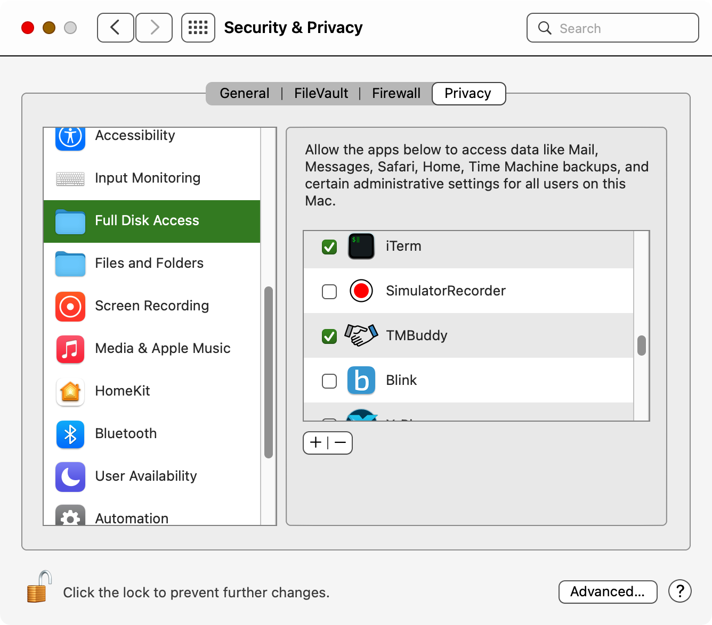

# TMBuddy

See and manipulate exclusions from Time Machine backup, right in Finder.

## Installation

1. Get the app

2. Make sure TMBuddyFinder is selected in System Settings > Extensions > Finder Extensions:
   
   

3. Make sure that TMBuddy is in the list of System Settings > Security & Privacy > Full Disk Access:
   
   

## What works

- Shows exclusion status for every item on the system disk (if you see the caution icon ⚠️ by the item, it means that the item is for sure not backed up):
  
  

## TODO

- Speedup lookups

- Add support for managing exclusion from backup via contextual menu command

- Add support for other disks than the system disk

## Hints

If you don't give it full-disk permissions, it will highlight only the items which exclusion is sticky, i.e. does not depend on the current location of the item.
