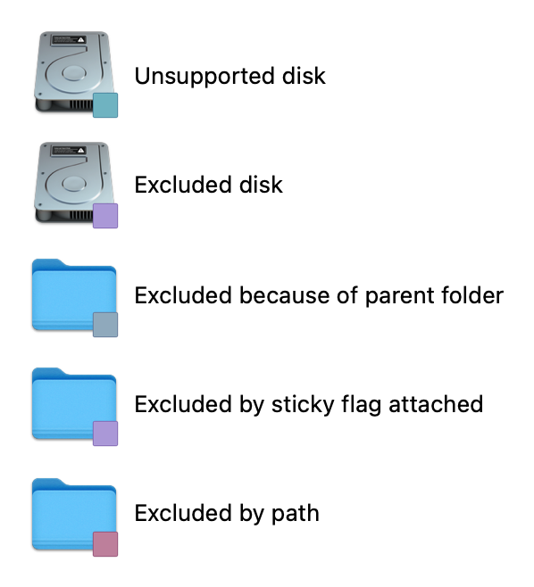
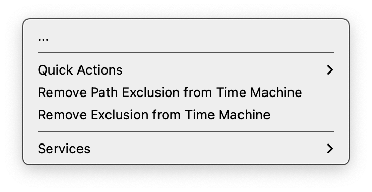
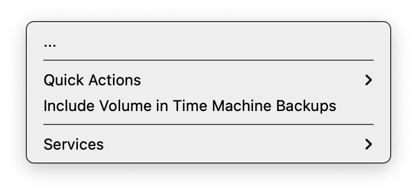
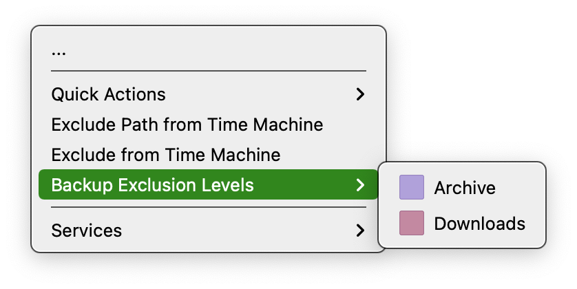
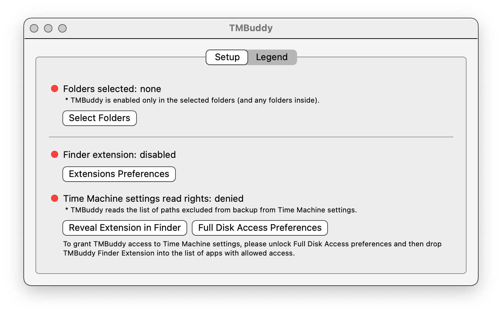

[](https://github.com/grigorye/TMBuddy/actions/workflows/build-app.yml)

# TMBuddy

See and manipulate exclusions from Time Machine backup, right in Finder.

## Features

- See exclusion status for every item of each monitored folder/disk:
  
  
  
- Toggle *sticky* or *fixed-path* [^*] exclusion via contextual menu (or toolbar item):
  
  |                  Exclude from Time Machine                   |              Remove Exclusion from Time Machine              |
  | :----------------------------------------------------------: | :----------------------------------------------------------: |
  |  |  |
  
  [^*]: Fixed-path exclusions are not availabile in AppStore/TestFlight version, but in Homebrew due to the need to install the privileged helper.
  
- Toggle exclusion of disks via contextual menu (or toolbar item):
  
  |                  Exclude from Time Machine                   |              Remove Exclusion from Time Machine              |
  | :----------------------------------------------------------: | :----------------------------------------------------------: |
  |  |  |
  
- Reveal the parent folders which implicitly affect the exclusion of the given item:
  
  

## Installation

1. Get the app

   - if you're on macOS 12 or later, from TestFlight:
     [Join the ™ Buddy beta - TestFlight - Apple](https://testflight.apple.com/join/gQCBR8p7)

   - from Homebrew:

     ```
     brew install grigorye/tools/time-machine-buddy
     ```

2. Launch the app and follow the checklist, making sure all the red lights:

   

   turned green:

   

When selecting folders for the application, typically you want to navigate to Computer and select all the disks for which you want to employ TMBuddy:


## Troubleshooting

- Sometimes attempt to toggle sticky exclusion results in nothing. Try re-adding the monitored folders in this case.
- If attempt to change fixed-path exclusion fails, please add TMBuddy.app (in addition to .appex) to the [list of applications eligible for full disk access](x-apple.systempreferences:com.apple.preference.security?Privacy_AllFiles) and make sure the access is enabled.

## TODO

- Menu bar item

## System Requirements

- macOS 10.15 or later

## License

MIT License. See [LICENSE](LICENSE).
