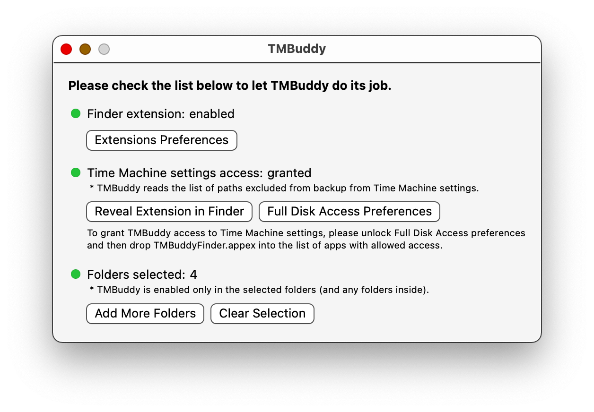

[](https://github.com/grigorye/TMBuddy/actions/workflows/build-app.yml)

# TMBuddy

See and manipulate exclusions from Time Machine backup, right in Finder.

## Installation

1. Get the app
   
   - if you're on macOS 12 or later, from TestFlight:
     [Join the ™ Buddy beta - TestFlight - Apple](https://testflight.apple.com/join/gQCBR8p7)
   
   - from Homebrew:
     
     ```
     brew install grigorye/tools/time-machine-buddy
     ```

2. Launch the app and follow the checklist, making sure all the red lights:
   
   turned green:
   

When selecting folders for the application, typically you want to navigate to Computer and select all the disks for which you want to employ TMBuddy:


## What works

- Shows exclusion status for every item on each monitored folder/disk:
  
  - Item excluded by path via Time Machine Settings:
    
    
  
  - Item excluded via sticky non-backup attribute:
    
    
  
  - Item excluded as it resides in a folder excluded from backup (this will be default for all items in excluded folders):
    
    

- Toggling *sticky* exclusion via contextual menu (or toolbar item):
  
  
  
  

## TODO

- Add support for toggling fixed-path exclusions
- Menu bar item

## System Requirements

- macOS 10.15 or later

## License

MIT License. See [LICENSE](LICENSE).
